# React Native Todoist Clone with Clerk

This is a React Native Todoist clone using [Clerk](https://go.clerk.com/1vaJMZL) for user authentication.

Additional features:

- [Expo Router](https://docs.expo.dev/routing/introduction/) file-based navigation
- [Expo SQLite](https://docs.expo.dev/versions/latest/sdk/sqlite/) for storing chats and messages
- [React Hook Form](https://react-hook-form.com/) for form handling
- [Calendars](https://github.com/wix/react-native-calendars) for calendar component
- [Bouncy Checkbox](https://github.com/wix/react-native-bouncy-checkbox) for checkbox component
- [Haptics](https://docs.expo.dev/versions/latest/sdk/haptics/) for haptic feedback
- [Reanimated](https://docs.swmansion.com/react-native-reanimated/) 3 for animations
- [Gesture Handler](https://docs.swmansion.com/react-native-gesture-handler/) for gestures
- [RN MMKV](https://github.com/mrousavy/react-native-mmkv) for efficient key/value storage
- [Sonner Native](https://gunnartorfis.github.io/sonner-native/) for toast notifications

## Setup

### Environment Setup

Make sure you have the [Expo CLI](https://docs.expo.dev/get-started/set-up-your-environment/) installed.

Because we are using pre-built and a custom development client, you should download [Android Studio](https://developer.android.com/studio) and [Xcode](https://developer.apple.com/xcode/) to your Mac. For more information on setting up your development environment, refer to the [Expo documentation](https://docs.expo.dev/workflow/android-studio-emulator/) for Android Studio and the [React Native documentation](https://reactnative.dev/docs/environment-setup?guide=native) for Xcode.

### App Setup
To build the app, perform the following steps:

1. Clone the repository
2. Run `npm install`
3. Run `npx expo prebuild`
4. Run `npx expo run:ios` or `npx expo run:android`

## App Screenshots

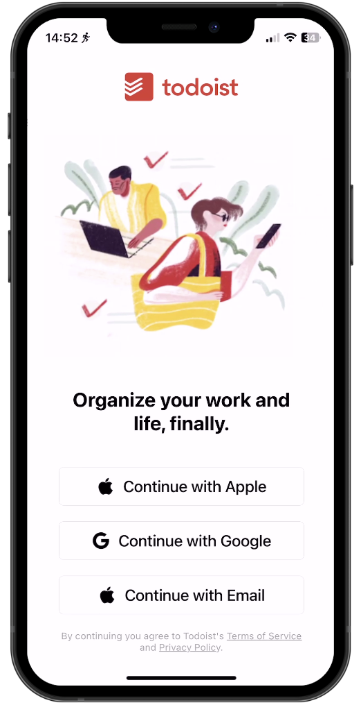
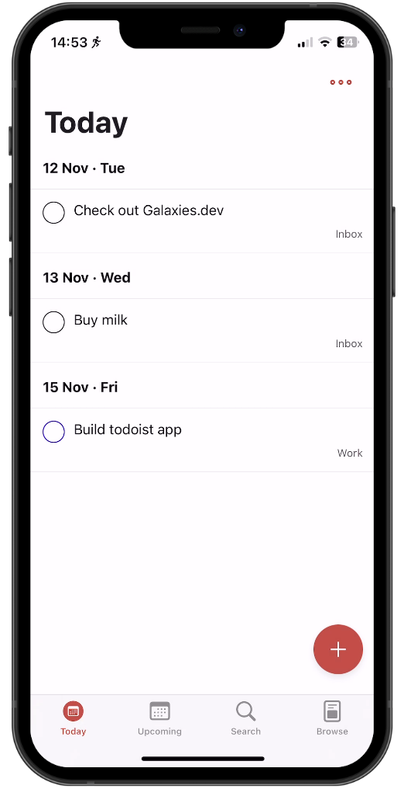
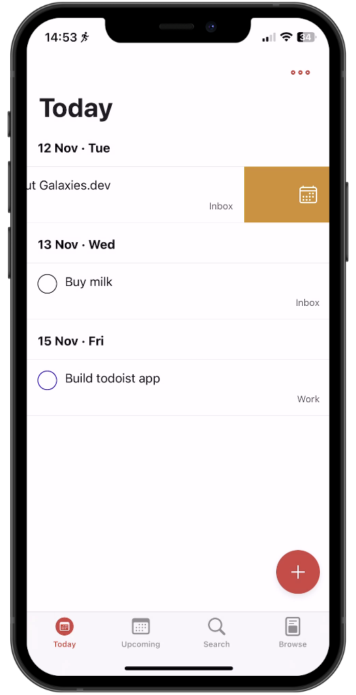
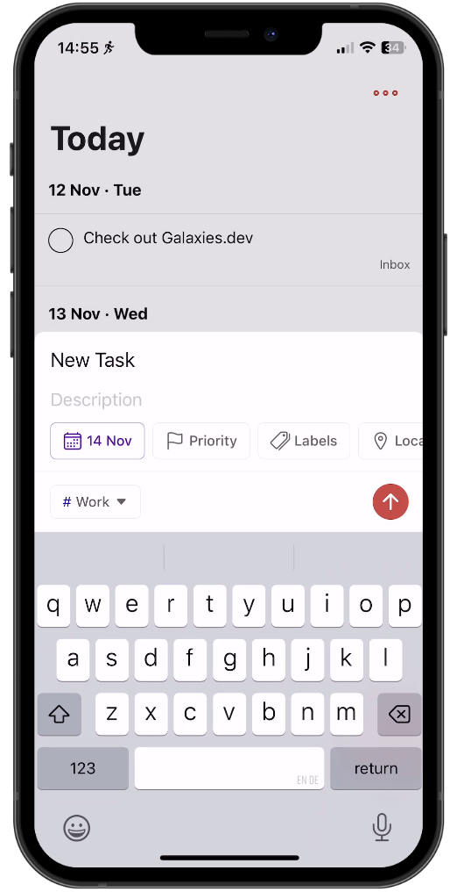
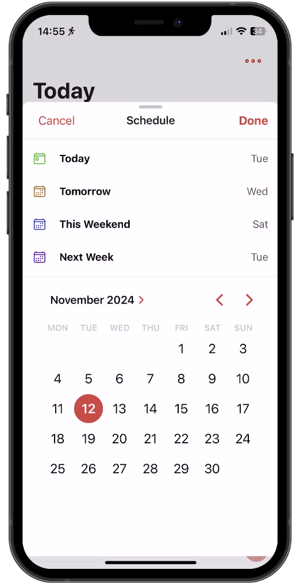
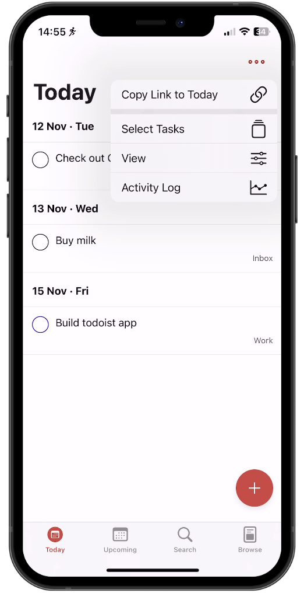
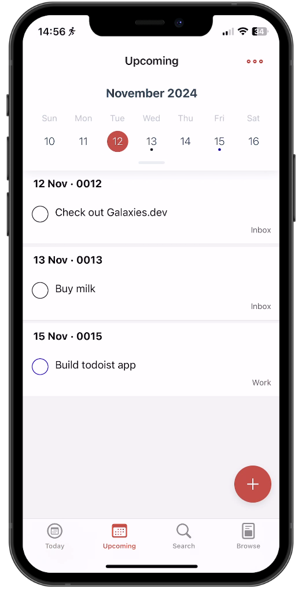
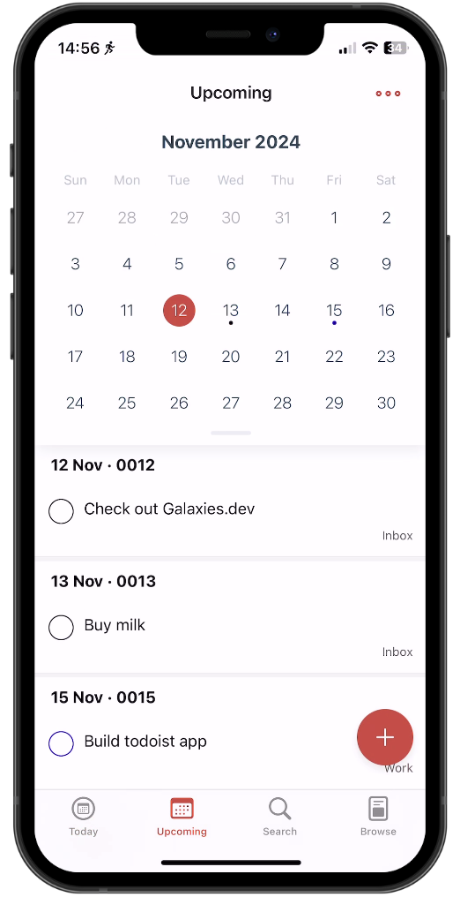
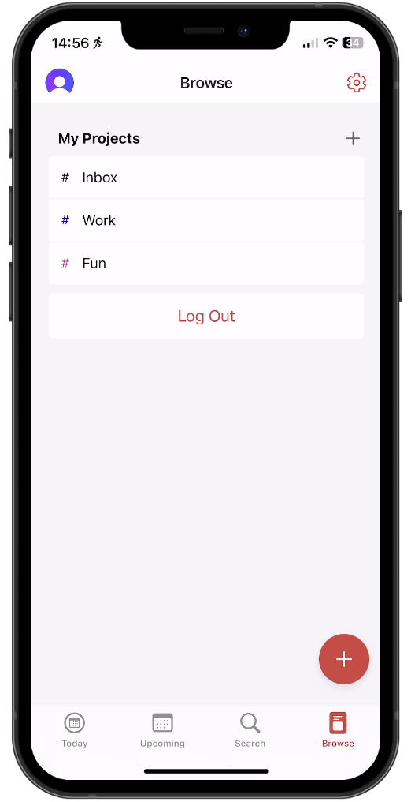
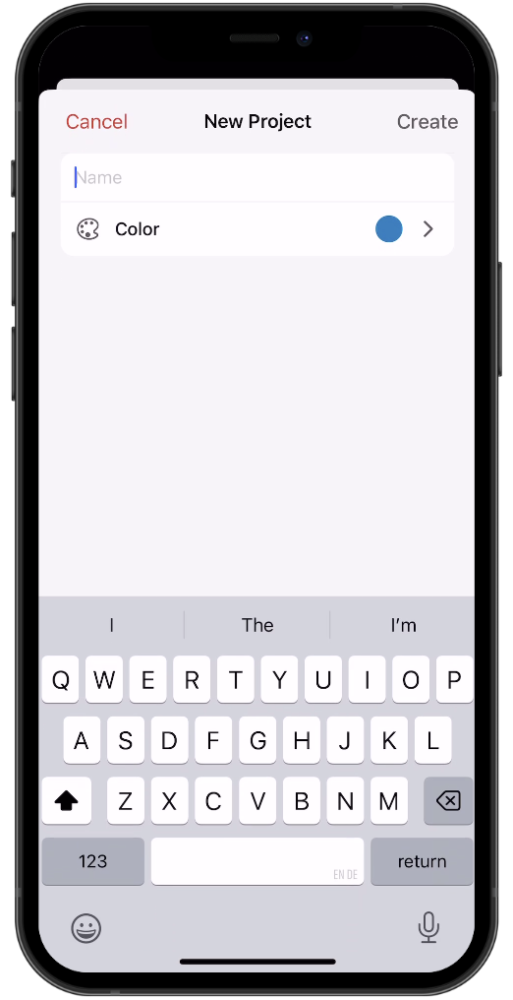

## Demo

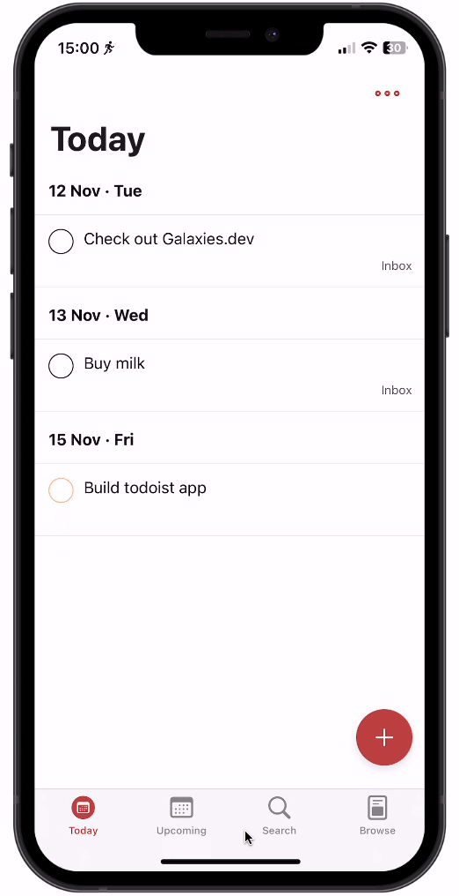

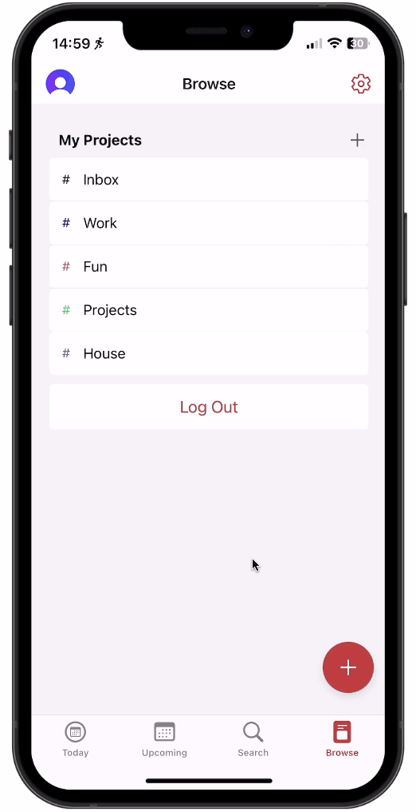
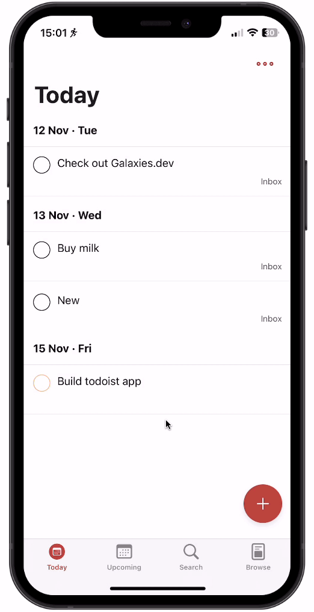

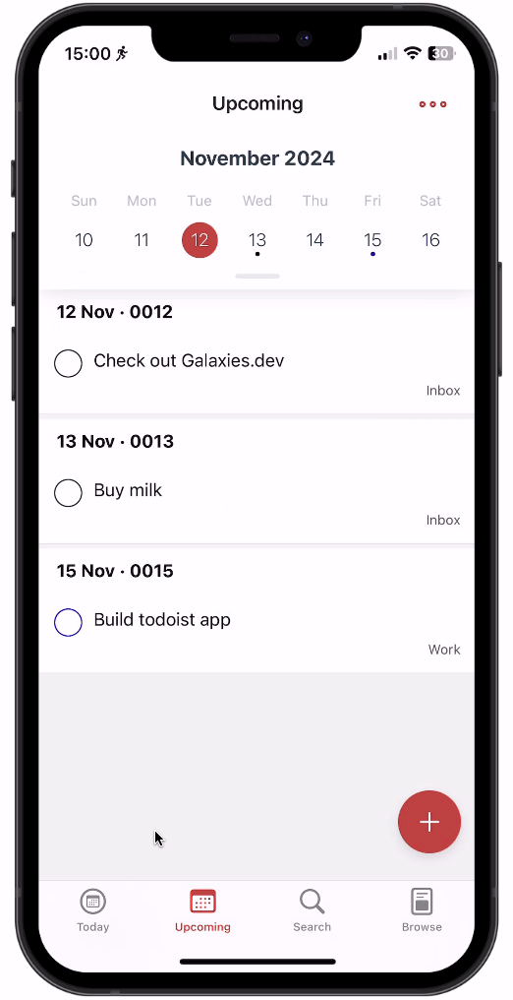

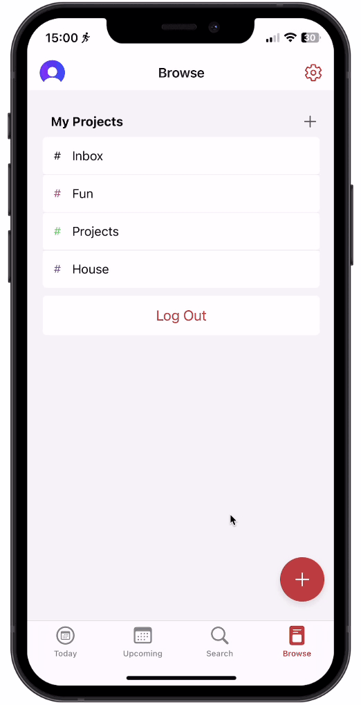

